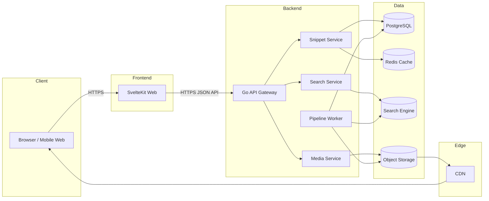
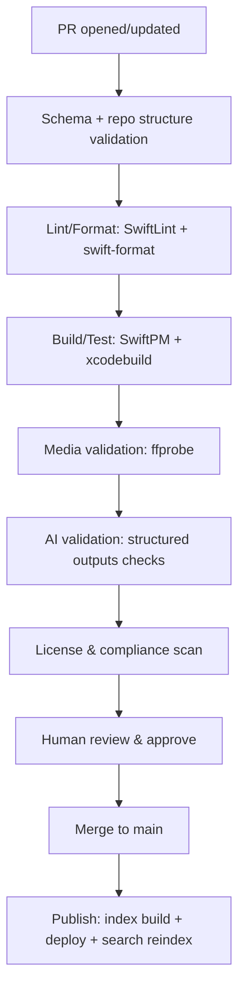
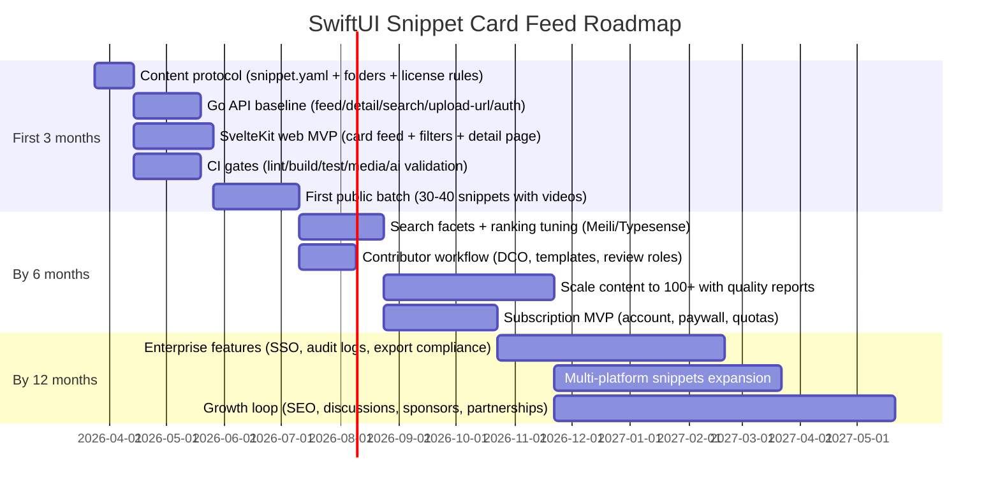

# SwiftUI 代码片段卡片流平台架构与实施报告

## 执行摘要

你要构建的是面向 SwiftUI 开发者与 Vibe Coding 用户的“可即用片段库”，以 entity["company","小红书","social app china"] 式卡片流承载三件事：可见的交互演示、可复制的源码、可复用的提示词。Vibe Coding 作为开发方式的文化来源，最常被追溯到 entity["people","Andrej Karpathy","ai researcher"] 在 X 上提出的“vibe coding”表述。citeturn0search2 同期，IDE 侧也在把“agentic coding”拉进主流工作流，entity["company","Apple","consumer electronics company"] 的官方公告称 Xcode 26.3 支持在 IDE 内直接使用包括 Codex 在内的 coding agents 执行复杂任务。citeturn0search1turn8search2 这两股力量叠加，让“提示词资产化”从可选项变成产品的核心差异点。citeturn8search0turn8search1

面向开发团队的关键建议如下，后文会给到可执行的架构与协议：

1) **内容即代码，协议先行**：每个片段用固定目录与 `snippet.yaml` 描述，媒体、源码、提示词同仓管理，版本、变更与许可写入元数据，利于 CI 自动校验与回滚。citeturn6search3turn6search2  
2) **前后端解耦部署**：SvelteKit 官方建议当后端用 Go 等非 JS 语言时，将前端独立部署并通过 API 取数。citeturn3search8turn10search3  
3) **媒体上传走预签名 URL，静态资源走 CDN**：用对象存储承载视频与截图，后端发放预签名上传 URL，可让上传方不持有云凭证。citeturn4search2 CDN 缓存策略用 TTL 与 Cache-Control 组合控制，避免频繁回源。citeturn4search3  
4) **搜索优先做分面与权重**：标签体系要支持分面筛选，搜索结果排序要能融合标题权重、难度、热度与新鲜度。Algolia、Typesense、Meilisearch 的官方文档都把 faceting 与 filtering 作为基础能力。citeturn2search3turn2search2turn2search13  
5) **鉴权与速率限制作为第一阶段必需品**：OAuth 2.0 适合做第三方登录与授权框架，JWT 适合做 API 访问令牌。citeturn5search0turn5search1 资源消耗型攻击在 OWASP API Security Top 10 中被强调，按端点做速率限制与配额需要落在网关层。citeturn5search2turn5search6 Go 生态中 `golang.org/x/time/rate` 明确提供 token bucket limiter。citeturn3search3turn3search11  
6) **AI 校验使用结构化输出**：OpenAI Structured Outputs 明确支持用 JSON Schema 强制模型输出字段完整且枚举合法，适合作为提示词与元数据一致性检查的自动化组件。citeturn8search0turn8search3  
7) **安全与合规把门前移**：NIST SSDF 提供安全开发实践框架，且有针对生成式 AI 与基础模型的增补版本。citeturn7search0turn7search1 同时，公开仓库的 secrets 泄露规模在 2025 年仍在增长，GitGuardian 报告给了量化数据与趋势判断，适合用来制定强制门槛。citeturn7search2

## 竞品与参考平台调研

下表选择了 6 个与你产品目标贴近的参考对象，覆盖官方教程、可运行样例、开源组件库、可复制片段库、付费内容平台。对比维度按你的需求展开：展示形式、内容结构、搜索与标签、贡献流程、许可与盈利。

image_group{"layout":"carousel","aspect_ratio":"16:9","query":["SwiftUI open source component library README GIF demo","SwiftUI tutorial preview Xcode screenshot","designcode swiftui course website screenshot","Svelte card feed masonry layout inspiration"],"num_per_query":1}

| 平台/项目 | 展示形式 | 内容结构（演示、代码、提示词） | 搜索与标签 | 贡献流程 | 授权许可 | 盈利模式 |
|---|---|---|---|---|---|---|
| entity["company","Apple Developer Documentation","developer docs platform"] SwiftUI Tutorials | 文档教程，结合预览与示例项目入口 | 演示与讲解强，代码以 sample 为中心，提示词缺位 citeturn0search0turn0search4 | 文档站内导航为主 citeturn0search0 | 外部贡献不属于常规入口 citeturn0search0 | 以 Apple 文档与样例许可为准，需逐项目核对 citeturn0search0 | 免费，生态投入 citeturn0search0 |
| entity["organization","SwiftUI Lab","swiftui education site"] A Companion for SwiftUI | 交互式文档产品与文章 | 演示与查找体验强，代码示例在内容内，提示词缺位 citeturn1search6turn1search2 | 以内容导航为主 citeturn1search6 | 非开源协作模式 citeturn1search6 | 商业授权，区分个人与商业购买 citeturn1search2 | 付费购买与授权形式明显 citeturn1search2turn1search6 |
| entity["company","Design+Code","design education platform"] | 课程站，视频与素材下载 | 演示视频与源文件强，提示词缺位 citeturn1search3turn1search19 | 站内分类与课程体系 citeturn1search19 | 非开源贡献模式 citeturn1search19 | 商业条款与付费权益为核心 citeturn1search3 | 订阅与付费计划 citeturn1search3turn1search19 |
| entity["organization","Exyte","software studio"] PopupView（代表开源 SwiftUI 组件库） | GitHub README 图与用法段落 | 演示图与示例代码强，提示词缺位 citeturn1search0turn1search4 | GitHub Topics 与 repo 内导航 citeturn1search0 | 标准 PR 贡献模式 citeturn1search0 | MIT 许可 citeturn1search4turn1search0 | 以品牌与生态影响力为主 citeturn1search0 |
| entity["organization","SwiftUIX","swiftui extensions project"] | GitHub 组件库 | 组件覆盖广，演示与代码多在 README 与源码，提示词缺位 citeturn1search11 | 依赖 GitHub 搜索与目录结构 citeturn1search11 | 标准 PR 模式 citeturn1search11 | MIT 许可 citeturn1search11 | 免费开源 citeturn1search11 |
| entity["organization","mbernson/SwiftUI-library","github snippet repo"] | GitHub 片段库，按 Views/Modifiers 组织 | 强调可复制单文件、无第三方依赖，提示词缺位 citeturn1search5 | GitHub 搜索为主 citeturn1search5 | 可 PR，偏个人库风格 citeturn1search5 | Unlicense citeturn1search1turn1search5 | 免费开源 citeturn1search5 |

对你的启发可以落到三点：  
第一，官方与优质项目都把“可运行与可信”放在第一位，你的片段库要把编译与最小 demo 作为默认门槛。citeturn0search0turn10search2  
第二，开源组件库靠 README 演示动图建立信任，你的卡片流把这种“先看效果”机制前置到信息流层。citeturn1search0  
第三，付费内容平台的价值在体系化与更新节奏，你可以把“提示词与生成验收”做成体系化产品层，形成差异点。citeturn8search0turn8search1

## 系统架构设计

本节按 Svelte 前端与 Go 后端的组合，给出服务划分、API 设计框架、数据存储与索引、媒体与 CDN、缓存与扩展、鉴权与速率限制。目标是让开发团队可以按模块并行推进。

### 目标与边界

产品形态是卡片流浏览与搜索，核心读路径包含：获取 feed，打开片段详情，复制代码与提示词，下载或播放媒体，按标签筛选与搜索。写路径包含：投稿上传媒体，提交 PR 或 Web 投稿，触发自动化校验，审核发布，搜索索引更新。

部署上建议前后端解耦，SvelteKit 官方在“后端使用 Go 等语言”场景中建议将 SvelteKit 前端单独部署。citeturn3search8turn3search4turn3search0

### 服务划分

建议按读写与职责拆分成 6 个逻辑域，早期可以合并部署，接口边界先固定：

1) **Web 前端**：SvelteKit 提供路由与渲染，卡片流支持 SSR 或静态生成与客户端增强。SvelteKit 采用文件系统路由，便于团队按页面拆分并行开发。citeturn3search0  
2) **API Gateway**：Go 服务统一入口，负责鉴权、速率限制、日志、请求聚合。可用标准 `net/http` 作为基础。citeturn3search2  
3) **Snippet Service**：片段元数据、版本、发布状态、统计数据。  
4) **Media Service**：媒体元数据与上传签发，统一生成预签名 URL，回源防盗链策略。AWS 文档明确预签名 URL 允许上传方不具备云凭证也能完成上传。citeturn4search2turn4search5  
5) **Search Service**：搜索索引写入与查询代理，封装对 Meilisearch 或 Typesense 的访问。Meilisearch 将 facets 视为特化过滤器的方式与教程文档适合作为参考。citeturn2search13  
6) **Pipeline Worker**：异步校验与发布流水线执行器，消费队列任务，产出校验报告与发布产物。

### 架构图



设计意图：读路径尽量走缓存层与 CDN，写路径通过异步 worker 解耦重任务，减少对主 API 的延迟影响。CDN 缓存时长控制可参考 CloudFront 的 TTL 与 Cache-Control 组合规则。citeturn4search3

### API 设计框架

建议以 REST 为主，JSON 编码，分页优先 cursor，避免 feed 偏移分页在高写入下的不稳定。端点按资源划分，早期保持简洁可演进：

- `GET /v1/feed`  
  参数：`cursor`，`limit`，`filters`（platform, difficulty, tags, license）  
  返回：卡片列表简版数据，包含媒体预览 URL、标题、标签、难度、更新时间、热度

- `GET /v1/snippets/{id}`  
  返回：完整卡片数据，包含代码包索引、提示词模板、版本列表、license 信息

- `GET /v1/search`  
  参数：`q`，`facets`，`sort`  
  返回：hit 列表与 facet counts

- `POST /v1/media/upload-url`  
  请求：文件类型、大小、目标路径、hash  
  返回：PUT 预签名 URL 与 headers  
  理由：对齐 AWS 预签名上传的通用做法。citeturn4search2

- `POST /v1/auth/login` 与 `POST /v1/auth/token`  
  适配 OAuth 2.0 授权框架与 token 颁发逻辑。citeturn5search0

SvelteKit 获取数据时，官方文档强调 server `load` 适合访问私有环境变量与服务端资源，这与“前端 SSR 调 API”契合。citeturn10search3turn10search23

### 数据存储、媒体与 CDN 策略

**数据库**：默认选 PostgreSQL，承载片段元数据、版本、发布状态、统计数据、用户与订阅信息。没有部署约束时，PostgreSQL 的成熟度适合做主存储。

**对象存储**：视频与截图放对象存储，路径按 `snippet_id/version/asset_type` 规范化。上传采用预签名 URL，降低后端带宽压力与权限暴露风险。citeturn4search2turn4search5

**CDN**：媒体走 CDN 分发，按对象类型设置 Cache-Control。CloudFront 文档对 TTL 与 Cache-Control 的交互给了明确规则，适合做缓存策略说明书。citeturn4search3  
建议区分两类缓存行为：  
1) 不易变更的媒体，用长 TTL，版本变更通过路径变更与内容哈希驱动  
2) 可能更新的 JSON 索引与 feed，短 TTL，配合 ETag 与条件请求

### 缓存、扩展性、鉴权与速率限制

**缓存**：Redis 做两类缓存。  
第一类是读缓存，缓存 feed 页与 snippet 详情，配合短 TTL。  
第二类是速率限制与配额计数器。

**扩展性**：Search 与 Media 都是天然可横向扩展域，Worker 可以按队列消费者数量扩容。Typesense 文档提到 indexed fields 存在 RAM 并有磁盘备份，这意味着容量规划要把字段量与数据规模纳入内存预算。citeturn2search14

**鉴权**：OAuth 2.0 用于第三方授权框架与登录，JWT 用于在客户端携带 claims 的访问令牌。citeturn5search0turn5search1

**速率限制**：OWASP API Security 2023 对资源消耗风险明确建议实施 rate limiting，并按业务端点细化策略。citeturn5search2turn5search6 Go 侧实现建议基于 token bucket，`golang.org/x/time/rate` 文档清晰描述 limiter 的桶容量与 refill 速率语义，便于把规则表达成配置。citeturn3search3turn3search11  
可落地的策略粒度：按 IP、按 user_id、按 API key 三层叠加，端点级别差异化。

## 数据与元数据模型

本节定义 `snippet.yaml` 的字段建议、用于搜索索引的字段映射、版本与变更策略。目标是让仓库协议与后端数据模型一一对应，便于 CI 校验与自动发布。

### `snippet.yaml` 字段建议

建议使用 YAML，配合 JSON Schema 描述字段完整性，在 CI 中做 schema 校验，后续也可以被 AI 校验任务复用。OpenAI Structured Outputs 说明了 JSON Schema 强制字段一致性的价值，适合作为“提示词与元数据一致”的约束机制参考。citeturn8search0turn8search3

字段集合按四类组织：

**标识与展示**
- `id`：全局唯一，kebab-case  
- `title`：卡片标题  
- `summary`：一句话价值描述  
- `category_primary`：主类目（layout, navigation, animation, input, media, state, accessibility, tooling）  
- `tags`：自由标签  
- `facets`：受控分面字段，供筛选

**平台与难度**
- `platforms`：iOS/macOS/watchOS/visionOS，含 minVersion  
- `difficulty`：easy/medium/hard  
- `requires_video`：bool  
- `dependencies`：第三方依赖清单，默认空

**许可与归属**
- `license_code`：SPDX identifier  
- `license_media`：媒体与文档许可  
- `authors`：署名与链接  
SPDX License List 明确提供标准短标识符与永久 URL，适合做机器可识别字段。citeturn6search3

**版本与发布**
- `version`：建议用 semver  
- `status`：draft/review/published/deprecated  
- `published_at`：发布日期  
- `changelog`：本次更新摘要  
- `source_commit`：Git commit hash  
- `content_hash`：媒体与代码内容哈希，用于 CDN 资源不可变策略

### 索引字段映射

为满足“卡片流浏览 + 搜索 + 分面筛选”，索引侧至少需要：

- 全文搜索字段：`title`，`summary`，`tags`，`category_primary`  
- 分面字段：`platforms`，`difficulty`，`license_code`，`requires_video`  
- 排序字段：`published_at`，`popularity_score`，`quality_score`

Typesense 的搜索参数文档强调查询字段与 facet/filter 字段组合是基本模式。citeturn2search2 Meilisearch 的 facets 教程说明 facets 属于 specialized filter，适合做分面界面。citeturn2search13 Algolia 的 faceting 文档同样强调 facets 用于分组与 refinement。citeturn2search3

### 版本与变更策略

建议把变更拆成两层：

1) **片段版本**：面向使用者的 API 与行为变更，用 semver  
2) **内容修订**：面向卡片资产更新，例如注释优化、媒体重录、不影响 API 的小修复，可用 `revision` 或 git tag

CDN 长缓存资源建议使用“内容哈希路径”，减少缓存失效与回源成本。CloudFront 的过期规则与 TTL 概念能支撑这类策略说明。citeturn4search3

## 卡片内容协议

本节定义媒体规范、代码目录结构、提示词模板、lint/format 策略、license 策略，并给出首批片段清单与示例卡片样例。

### 媒体规范

**视频规格**
- 比例：9:16 优先，兼容 1:1  
- 分辨率：1080×1920 与 1080×1080 两套  
- 帧率：30fps  
- 时长：6 到 12 秒  
- 容器：MP4，H.264

**录制指南**
- 优先用 Simulator 内建录制入口，Apple 文档提供“Record Screen”路径。citeturn4search0  
- 脚本化录制使用 `xcrun simctl io booted recordVideo ...`，Apple 的 Simulator Guide 给出命令与停止方式。citeturn4search1  
- 录制前统一设备与系统版本，避免卡片流画面比例与系统 UI 差异造成观感不一致。

### 代码目录结构协议

每个 snippet 一个目录，目录结构固定，便于 CI 做结构校验与发布打包：

```text
snippets/<snippet_id>/
  snippet.yaml
  Media/
    cover.png
    demo.mp4
  Code/
    SwiftUI/
      Sources/
      Demo/
      README.md
    Vibe/
      prompt.yaml
      prompt.md
      acceptance.md
  Tests/
  LICENSES/
    THIRD_PARTY.md
```

约束动机：让“复制粘贴用户”与“工程落地用户”都能找到入口，同时也让 AI 校验可以对齐 deliverables 与 acceptance checklist。citeturn8search0turn8search1

### 提示词模板协议

提示词分成两种形态：人读文本与机器可校验结构化版本。结构化版本以 JSON Schema 约束字段，文本版用于直接复制到对话式工具。

OpenAI 的提示工程指南建议清晰指令、提供上下文与约束条件来提升输出质量，同时 Structured Outputs 能保证字段完整与枚举合法。citeturn8search1turn8search0

结构化模板建议字段：

- `goal`：要生成的组件与其用途  
- `platform`：最低系统版本与 target  
- `constraints`：禁止三方依赖、必须可访问性、性能限制  
- `deliverables`：需要输出的文件列表  
- `acceptance_tests`：编译通过、交互通过、边界行为  
- `variants`：常见变体，便于二次生成  
- `known_pitfalls`：模型常犯错清单

### lint/format 策略

Swift 侧建议组合使用 `swift-format` 与 SwiftLint：

- `swift-format` 文档说明其配置文件是 JSON 并可用于 CLI 或 API，便于统一格式配置。citeturn10search0turn10search4  
- SwiftLint 项目定位是“enforce Swift style and conventions”，适合做风格与约束门槛。citeturn9search3  

Go 与前端侧可在同一 CI 中采用各自生态常用 lint 工具，门槛放在“可自动修复的格式问题自动修复，不可修复问题阻断合并”。

### license 策略

建议分离代码与媒体许可：

- 代码：Apache-2.0 或 MIT，Apache-2.0 的权利与义务摘要在 choosealicense 与 OSI 页面较清晰。citeturn11search2turn11search0  
- 媒体与文档：CC BY 4.0，CC 的 deed 明确要求署名、链接与修改标注。citeturn11search1  
- CC 官方 FAQ 表示不推荐将 CC 用于软件代码，但可用于文档与艺术元素，这与“代码与媒体分离许可”方向一致。citeturn11search7  
- 所有许可字段写入 SPDX identifier，SPDX License List 提供标准短标识。citeturn6search3turn11search4

### 首批片段清单建议

首批建议覆盖“卡片流高频组件 + 常见交互动效 + 数据状态基建 + 工程化与 AI 协作模板”。下表给出 36 个片段，按场景与优先级排序，标注难度与是否需要视频。

| 优先级 | 场景 | 片段 | 难度 | 需要视频 |
|---:|---|---|---|---|
| P0 | 卡片流 | 通用 Card 容器（圆角、阴影、按压态、暗色适配） | easy | 可选 |
| P0 | 卡片流 | 瀑布流 Masonry Grid（两列，动态高度） | hard | 是 |
| P0 | 卡片流 | 骨架屏 shimmer（列表与卡片） | medium | 是 |
| P0 | 卡片流 | 图片渐进加载与失败重试（无三方依赖版本） | medium | 可选 |
| P0 | 卡片流 | 标签 Chips 自动换行布局 | medium | 可选 |
| P0 | 交互动效 | 点赞按钮弹性缩放与状态切换 | medium | 是 |
| P0 | 交互动效 | 双击图片点赞（浮层心形） | hard | 是 |
| P0 | 交互动效 | 收藏按钮长按提示与状态切换 | easy | 是 |
| P0 | 导航结构 | 可折叠吸顶 Header（滚动折叠） | hard | 是 |
| P0 | 导航结构 | 空状态组件（图标、文案、动作） | easy | 可选 |
| P0 | 导航结构 | 搜索页骨架（搜索框、历史、热门标签） | medium | 是 |
| P0 | 数据状态 | LoadableView 三态（loading/empty/error/content） | medium | 可选 |
| P0 | 数据状态 | 分页加载列表（上拉加载更多） | hard | 是 |
| P0 | 工程化 | Design Tokens（颜色、圆角、间距）与暗色体系 | medium | 可选 |
| P0 | 工程化 | Previews 状态集合规范（多状态预览） | easy | 否 |
| P0 | AI 协作 | 提示词模板包：组件生成与验收清单 | medium | 否 |
| P1 | 卡片流 | 可复用卡片标题栏（头像、昵称、关注按钮） | medium | 是 |
| P1 | 交互动效 | 拖拽排序（带震动反馈） | hard | 是 |
| P1 | 交互动效 | 下拉刷新与顶部提示条 | medium | 是 |
| P1 | 输入表单 | 搜索输入框（清除、提交、去抖） | easy | 可选 |
| P1 | 输入表单 | 多行输入框（字数统计与限制） | medium | 可选 |
| P1 | 媒体展示 | 短视频封面卡（播放按钮、时长角标） | medium | 是 |
| P1 | 媒体展示 | 九宫格图片（最多 9 张，点击预览入口） | hard | 是 |
| P1 | 可访问性 | 卡片 VoiceOver 顺序与 label 模板 | medium | 否 |
| P1 | 性能 | 列表性能示例：图片缓存与解码策略提示 | hard | 是 |
| P1 | AI 协作 | AI 自检模板：生成测试与边界处理 | medium | 否 |
| P2 | 导航结构 | 自定义 TabBar 中间发布按钮 | hard | 是 |
| P2 | 输入表单 | 星级评分组件与手势交互 | easy | 是 |
| P2 | 媒体展示 | 全屏图片预览（缩放、下滑关闭） | hard | 是 |
| P2 | 国际化 | RTL 布局示例与注意点 | medium | 可选 |
| P2 | 工程化 | 轻量埋点 Hook（点击与曝光） | medium | 否 |
| P2 | 合规 | 依赖与许可声明生成模板（THIRD_PARTY.md） | medium | 否 |
| P2 | AI 协作 | 错误修复提示词模板（粘贴报错复现） | medium | 否 |
| P2 | 组件扩展 | Toast/Popup 基础实现（对齐常见开源组件体验） | hard | 是 |
| P2 | 数据状态 | 本地缓存 Key 封装与迁移策略示例 | easy | 否 |

### 示例卡片完整样例

以下样例演示卡片三段式协议如何落在仓库结构与 API 数据上，刻意避免进入实现代码细节。

**卡片标题**  
LikeButton：轻量弹性反馈，适合卡片流高频互动

**媒体说明**
- 封面：未点赞状态的按钮与计数  
- 视频：8 秒，30fps，竖屏 1080×1920  
- 演示步骤：点按切换两次，中间停留 0.5 秒，最后停留 1 秒用于封面截帧  
- 录制方式参考 Simulator 录屏入口与 `simctl recordVideo` 命令。citeturn4search0turn4search1

**代码结构示例**
```text
snippets/like-button/
  snippet.yaml
  Media/
    cover.png
    demo.mp4
  Code/
    SwiftUI/
      Sources/
        LikeButton.swift
      Demo/
        LikeButtonDemoView.swift
      README.md
    Vibe/
      prompt.yaml
      prompt.md
      acceptance.md
  Tests/
    LikeButtonLogicTests.swift
  LICENSES/
    THIRD_PARTY.md
```

**提示词模板示例**

结构化版本 `prompt.yaml`：

```yaml
goal: "Generate a reusable SwiftUI LikeButton component for card feeds"
platform:
  os: "iOS"
  min_version: "17.0"
constraints:
  - "No third-party dependencies"
  - "Keep animation lightweight for scrolling lists"
  - "Include accessibility labels and values"
deliverables:
  - "LikeButton.swift (public API + configuration struct)"
  - "LikeButtonDemoView.swift (demo screen for preview)"
  - "At least 2 previews (liked/unliked)"
acceptance_tests:
  - "Compiles in Xcode"
  - "Tap toggles state and updates count"
  - "VoiceOver announces correct state"
known_pitfalls:
  - "Do not store state globally"
  - "Do not omit previews"
  - "Do not break dark mode contrast"
```

文本版 `prompt.md` 写作要点：用一段上下文描述使用场景，再列清晰的 deliverables 与验收清单。OpenAI 的提示工程建议强调清晰指令与上下文约束，Structured Outputs 适合把这些字段做强约束输出。citeturn8search1turn8search0

## CI/CD 与自动化

本节以“仓库即内容源”为前提，为 Svelte 前端、Go 后端与 snippet 内容库提供统一流水线蓝图，覆盖构建、测试、媒体校验、AI 校验、发布与回滚。建议默认使用 entity["company","GitHub","code hosting platform"] Actions，原因是官方文档给出了 Swift 的构建与测试指南，适合作为团队共识基线。citeturn0search3turn0search9

### 流水线阶段



关键依据与实现要点：

- **Swift 构建与测试**：xcodebuild 是 Apple 官方命令行工具，能执行 build 与 test，适合做 DemoApp 与 UI 相关片段的门槛。citeturn10search2 SwiftPM 的 CI 文档提供了在既有 CI 中构建包与消费包的指导。citeturn10search1turn10search14  
- **格式化与 lint**：`swift-format` 配置文件语义由官方仓库文档说明，适合在 CI 中实现一致性。citeturn10search0 SwiftLint 项目说明其用来 enforce 社区通行的 Swift 风格。citeturn9search3  
- **媒体校验**：ffprobe 官方文档说明其用于读取媒体信息与多种输出格式，适合做分辨率、帧率、时长的硬校验。citeturn9search2  
- **AI 校验**：以 Structured Outputs 要求模型输出固定 schema，检查 `snippet.yaml` 与 `prompt.yaml` 字段匹配、deliverables 是否覆盖目录结构、acceptance_tests 是否包含编译与交互项。Structured Outputs 官方文档强调其能避免缺 key 与无效 enum。citeturn8search0  

### 发布与回滚策略

发布建议采用两阶段：  
1) 合并主分支触发生成全量索引与静态页面产物  
2) 部署成功后触发 search reindex

回滚策略以“索引版本可回滚”为核心，索引生成产物按版本号与 commit hash 存储，保证前端与后端能回到一致快照。缓存层与 CDN 依赖内容哈希与 TTL 管控，减少回滚时缓存污染。citeturn4search3

## 搜索与标签实现选型与增长商业化

本节提供 Lunr、Meilisearch、Typesense、Algolia 的对比表，给出分面与权重策略建议，同时覆盖商业化与增长渠道的可执行做法。

### 搜索引擎选型比较

| 方案 | 部署形态 | 分面筛选 | 相关性与权重 | 运维成本 | 适合阶段 |
|---|---|---|---|---|---|
| Lunr.js | 前端本地索引 | 需要自建 faceting 逻辑 | 支持 term boosting 与 fuzzy matching，偏客户端能力 citeturn2search12turn2search0 | 低，纯静态 | MVP 与小规模数据 |
| entity["company","Meilisearch","search engine vendor"] | 自建服务 | 文档明确 facets 是特殊过滤器，可配置并用于搜索界面 citeturn2search13 | 内建 ranking rules 与 typo tolerance，默认 typo 容错规则有明确阈值 citeturn2search1turn2search9 | 中 | 早期到中期，追求快速体验 |
| entity["company","Typesense","search engine vendor"] | 自建服务 | 文档明确支持 filters 与 facets citeturn2search2 | ranking 与 `_text_match` 等机制有明确描述，索引字段存 RAM 需容量规划 citeturn2search10turn2search14 | 中 | 数据量增长后仍需低延迟 |
| entity["company","Algolia","hosted search company"] | 托管服务 | facets 是核心能力并提供 counts citeturn2search3turn2search19 | ranking 配置与自定义排序能力成熟 citeturn2search23turn2search7 | 低到中，费用随规模增长 | 商业化后追求省运维 |

推荐路径：  
- MVP 起步可以用 Meilisearch 或 Typesense，原因是分面筛选与 typo 容错是“卡片流找片段”体验的关键，同时自建成本可控。citeturn2search13turn2search2turn2search1  
- 进入商业化与大规模访问后转 Algolia 或保留自建并强化运维，看团队成本结构。citeturn2search3  
- Lunr 更适合作为离线模式或小数据集备用方案，它的文档明确支持 boosting 与 fuzzy matching，但面对多分面筛选需要额外工程。citeturn2search12turn2search0

### 分面与权重策略

建议从一开始就定义受控分面字段，避免后期迁移成本：

- Facets：platform、difficulty、category_primary、license_code、requires_video、third_party_deps  
- 权重策略：标题字段加权，summary 其次，tags 再次，提示词文本不进入默认全文索引，只用于“高级搜索”  
- 排序策略：默认综合 `_text_match` 或内建 ranking，再叠加 `quality_score` 与 `popularity_score` 作为 tie-breaker。Typesense 的 ranking 文档说明可用 `_text_match` 及用户自定义字段参与排序。citeturn2search10

### 商业化与增长策略

商业化建议分三层，兼顾社区扩散与企业付费诉求：

- 免费层：完整浏览与搜索，复制部分代码与提示词，基础筛选  
- 个人订阅：完整提示词包、全量视频、批量导出、离线包、收藏同步  
- 企业授权：私有部署或私有索引、合规报告导出、内部片段镜像、审计日志与 SSO

社区增长建议以开发者工具链为主阵地：

- entity["company","GitHub Sponsors","sponsorship platform"] 作为开源维护与赞助入口，官方文档说明 Sponsors 让社区直接资助维护者与组织。citeturn9search4turn9search0  
- entity["company","GitHub Discussions","community forum feature"] 用来承载需求征集、片段提案与提示词迭代讨论，官方文档将其定位为项目社区的协作讨论空间。citeturn9search1  
- SEO 侧重点围绕“可运行 demo + 结构化元数据”，卡片详情页用 SSR 提供可索引内容，媒体资源通过预加载与 CDN 保障首屏体验。citeturn3search0turn3search4turn4search3

## 贡献审核、风险合规与实施里程碑

本节覆盖贡献流程、DCO/CLA 建议、自动合规扫描，同时列出版权、第三方依赖许可、隐私、AI 生成内容责任等风险点，并给出 3/6/12 个月里程碑。

### 贡献与审核流程

**入口选择**：优先 PR 模式，原因是可天然获得版本历史、审查记录与 CI 结果，同时也便于内容库与后端代码统一治理。citeturn0search9turn6search2

**DCO 与 CLA 选择**  
- DCO：适合轻量化贡献确认。Developer Certificate of Origin 文本要求贡献者证明其有权提交贡献并遵循项目许可。citeturn6search0  
- CLA：当你计划企业授权、双许可或需要更强法律确权时可考虑。CLA assistant 项目说明其支持在 PR 中完成 CLA 签署流程，并通过 GitHub 机制更新状态。citeturn6search1turn6search5  

建议路径：早期用 DCO 作为默认门槛，企业路线明确后再引入 CLA，避免贡献摩擦过早抬高。

**自动化合规扫描门槛**
- `dependencies` 字段必须填写，留空代表无三方依赖  
- third-party license 必须写入 `LICENSES/THIRD_PARTY.md` 并与 SPDX identifier 对齐  
- 许可证字段必须使用 SPDX 短标识符，SPDX License List 明确其提供标准 identifier 与 canonical URL。citeturn6search3  
- repo 必须明确 license，GitHub 文档说明可通过 license template 或手动添加 license 文件。citeturn6search6turn6search2

### 风险与合规要点

**版权与许可**
- 片段库如果包含改编或复制外部代码，需要保持原项目 license notice 并确认许可兼容。  
- 代码与媒体分离许可可降低误用风险，CC FAQ 表示 CC 不推荐用于软件本身，适合用于文档与艺术元素，这与策略一致。citeturn11search7turn11search1

**第三方依赖许可**
- 依赖引入要可追踪、可审计，元数据强制声明，CI 自动扫描阻断。

**隐私与敏感信息**
- Demo 视频与截图容易携带个人信息或内部服务信息，上传前需强制使用 mock 数据。  
- GitGuardian 的 2026 报告给出 2025 年公开 GitHub commits 中新增 hardcoded secrets 的数据规模，并提到 AI 使用与泄露增长的关系，适合作为“强制 secrets 扫描与门禁”的依据。citeturn7search2

**AI 生成内容责任**
- AI 生成代码可能引入漏洞。学术研究在大规模样本上量化了模型生成代码的漏洞比例，并强调投入生产前需要风险评估与验证。citeturn7search3  
- NIST SSDF 给出安全开发实践框架，且有面向生成式 AI 与基础模型的增补版本，可作为你对内对外的安全流程依据。citeturn7search0turn7search1

### 实施里程碑

下面路线图以当前日期 2026-03-24 为起点，按 3/6/12 个月阶段推进，优先把“协议、校验、搜索、首批内容”做成闭环。



这份路线图隐含的组织方式是：协议与门槛先固化，内容供给才能规模化，并能持续保持一致体验。SvelteKit 的路由与部署适配体系能支持前端独立发布的节奏。citeturn3search0turn3search4 Go 侧的 token bucket 限流与 OWASP 的资源消耗风险建议，则为上线后的稳定性提供底线。citeturn3search3turn5search2
